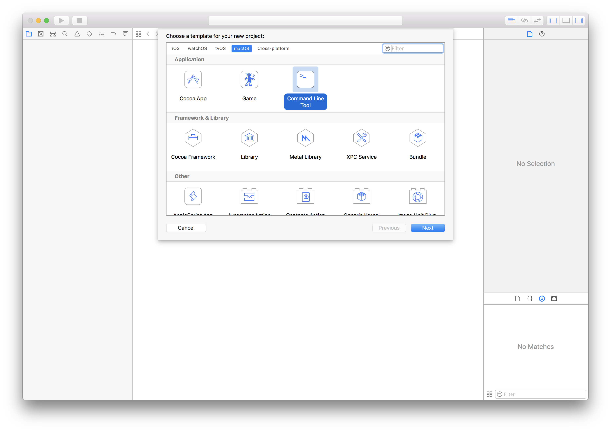
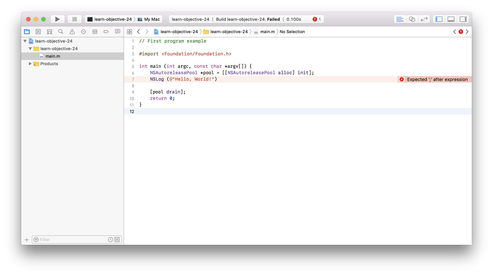
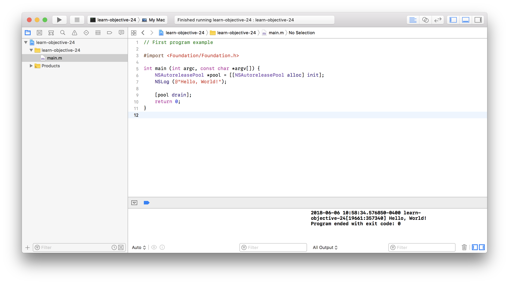

## Objective-C Lesson 1: Hello, World!

Since Dennis Ritchie demoed the C programming language, it has been conventional to begin a programming course with a program that writes the words “Hello world!” to the computer screen. Diving right in, the code is shown below.

**Program 1.1**

```objc
// First program example

#import <Foundation/Foundation.h>

int main (int argc, const char *argv[]) {
        NSAutoreleasePool *pool = [[NSAutoreleasePool alloc] init];
        NSLog (@"Hello, World!");
        [pool drain];
        return 0;
}
```

### Using Xcode

So what does all this gibberish mean? Before we can get to that, we’ll run the program first.

[Download a copy of Xcode](https://developer.apple.com/xcode/downloads/), if you don’t have it already, and install it. Navigation to your boot drive (usually Macintosh HD), and the folder called Developer. Inside, there will be a folder called Applications. Xcode, and some other programs you will be using, is in there.

Launch Xcode. The first thing you’ll see is the launch window:


Click on “Create a new Xcode project,” or select File > New Project (⇧⌘N). The button is highlighted in the image above. You will be greeted by the following window:



Select Application under macOS on the top, and choose Command Line Tool. Click Next

Name your project, and save it somewhere on your hard drive. In a few moments, you’ll see Xcode’s main interface:


We’ll take more about the parts of the window in later sections. Click on the file called main.m, or something similar. This should bring up the editor window. Replace the code in the editor view with the code above, so that it looks like this:


Don’t worry about all the colors- we’ll discuss that later. When you have entered the code, save the file, and click the play button in the top left, or ⌘r to run.

If you’ve made a mistake when typing it in, the header at the top of Xcode’s window will change, and a message bubble will appear:



Go back, and check the code.

When everything is working, you’ll see yet another window:



```
2018-06-06 10:58:34.576850-0400 learn-objective-24[19661:357340] Hello, World!
```

The beginning of the line shows the date and time, followed by the name of the program, and bunch of gibberish. But at the end of the line is the text that you expected to see: The program has written the words “Hello, World!” onto the screen.

Throughout the rest of these tutorials, the text that appears before that actual text that is outputted will be omitted for brevity.

### Code, Demystified

Now that you’ve created a working program, let’s talk about how it works.

In Objective-C, a capital and lowercase letter mean different things. So, main, Main, and mAin are three completely different things, and cannot be used interchangeably. Also note that white space- spaces, tabs, and blank lines are ignored. You can use this to format your code properly. Take advantage of this freedom to properly format your code.

The first line of the program is a comment:

```objc
// First program example
```

Comments exist solely for the benefit of the programmer. Comments are important, because they allow the developer to explain a thought process. They help demystify the code, and make documenting the code sometime down the road easier. Comments help during the debugging process, or when you revisit your code some time later. It also helps other people who may use your code understand why things are the way the are. The compiler ignores comments, so you can type anything into a comment.

There are two types of comments in Objective-C. One is shown above, in which every line of the comment is preceded by two slashes. This type of comment ends at the end of the line.

A comment can also be written across multiple lines, with the following syntax:

```objc
/*
A multi-line comment can be inserted
by using a slash
and then an asterisk.
The comment can be as long as you want,
but make sure you close it
with an asterisk, then a slash. */
```

Which style you choose is a matter of preference, or as the situation dictates.

The next line of the program imports, or brings into your project, a file called Foundation.h:

```
#import <Foundation/Foundation.h>
```

The file in question is a system file, and that is why the name is enclosed in the brackets < and >. If you were importing a local file , you would enclose the file name in double quotes “ and ”. This file is imported because code later in the file requires information that is contained in this file; you are telling the compiler to look up the information in that file as necessary.

The following line declares a function called main:

```objc
int main (int argc, const char *argv[]) {
```

`main` is a function that is where every C or C-based program begins. It is a reserved name, which means that you can’t have a function named main. The word int that precedes main is a declaration of the return type of the function. These topics will be discussed in further chapters.

After identifying main to the compiler, you tell the system what to do when it is called. These statements are enclosed in the braces `{ ... }` that surround the next few lines. Every opening brace has to be matched with a closing brace.

The first statement in main is as follows:

```objc
NSAutoreleasePool *pool = [[NSAutoreleasePool alloc] init];
```

This involves memory management, which is a topic thoroughly discussed in upcoming chapters.

The next line calls NSLog, which, along with the NSAutoreleasePool from above, is a function brought in by Foundation.h, which you imported.

```objc
NSLog (@"Hello, World!");
```

This line tells the function NSLog, which is designed to output text, to print the characters "Hello, World!" on the screen.

The leading `@` in front of the string signifies to the compiler that this is an NSString (another object brought in from the Foundation.h file), not a C-style string. For the most part, you will be using NSStrings, rather than C-style strings.

All statements, or lines that indicate some action, must be terminated with a semicolon ; just like regular sentences are terminated with a period.

The next line is part of the `NSAutoreleasePool`, and its purpose and meaning will be discussed in a later chapter. The final line tells the main method to return the value 0. Remember that the int the preceded main tells the system that this function will return a value. This value is 0. By convention, a return value of zero indicates that the function was successful.

```objc
return 0;
```

This line is followed by a closing brace, signifying the end of the main function.

If you look back at the window that displays the output of your program, you should see the line

```
Program ended with exit code: 0
```

This is an indication of the return value of main.

Congratulations, you have created your first program in Objective-C!

*This post is part of the [Learn Objective-C in 24 Days](38.md) course.*

---

[Previous Lesson](40.md) | [Next Lesson](44.md)
