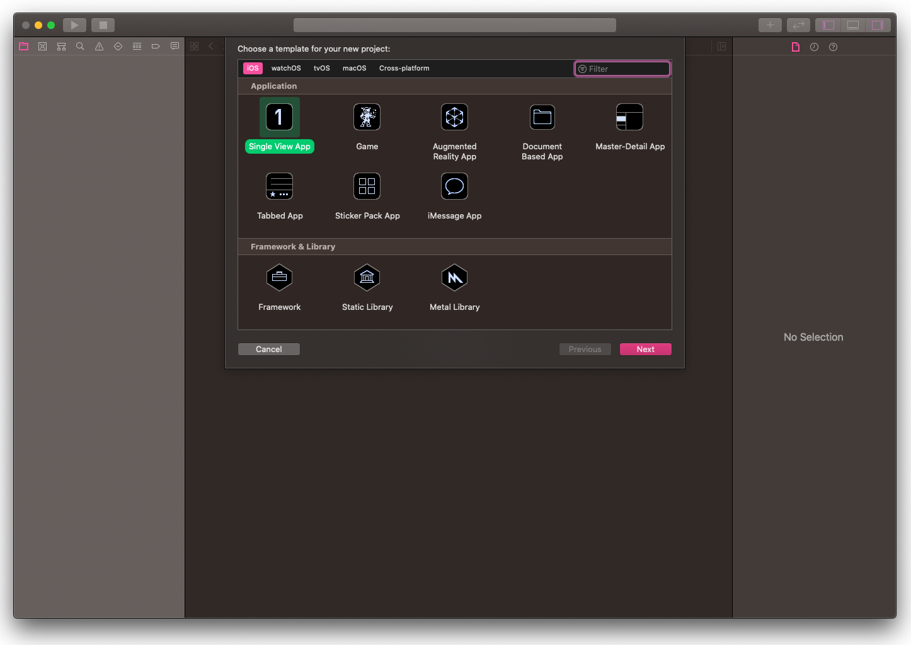
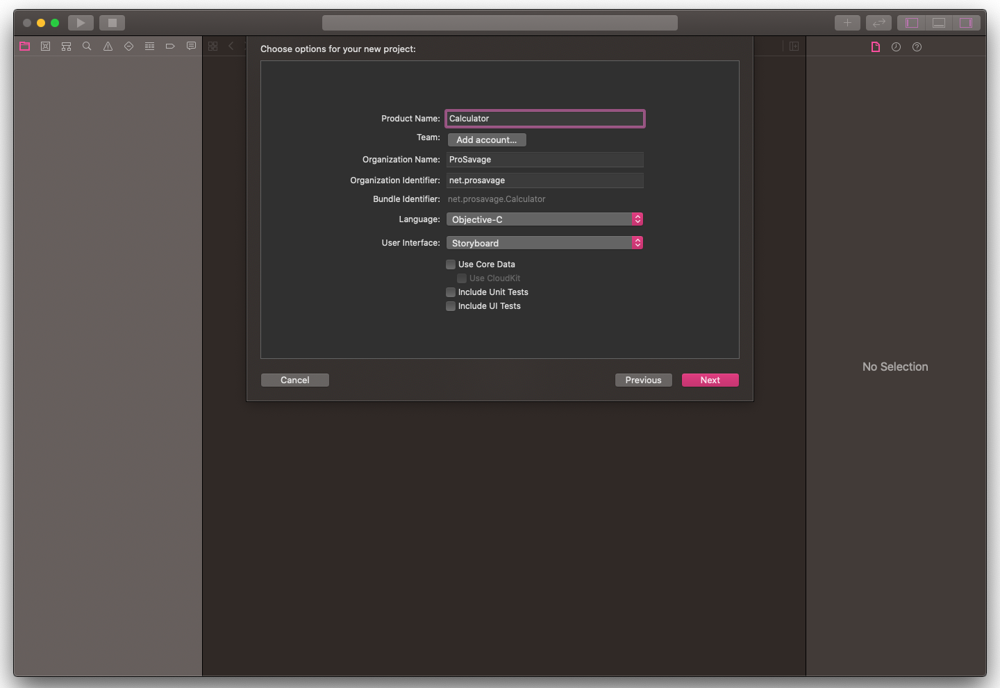
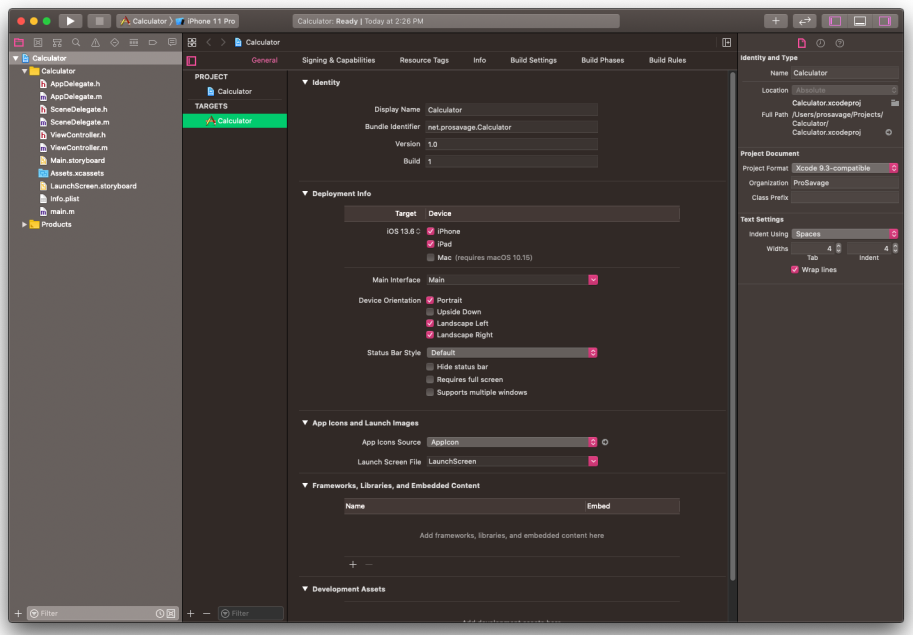

## Creating a New iPhone Project

Over the next few Lessons, we will be creating a full-functioned calculator, that can handle basic arithmetic, as well as fractional operations. By the end, we will also have a GUI (graphic user interface), but for now, we will be working off the console, as we have been doing.

We’ll begin by creating a new project in Xcode. Let’s begin!

### Creating the Xcode Project

Launch Xcode. When the launch window shows up, click “Create a new Xcode project”; alternatively, navigate to File > New Project (⇧⌘N). Choose the “Single View App”, and make sure “Product” is “iOS.” See the screenshot below:

Save the project anywhere on disk; I’d recommend having a dedicated “Developer” folder in your Home folder. I’d also strongly recommend that you save your project as “Calculator”; otherwise, your code could result in errors.

You will see the File list, the Organizer, and the Toolbar. For this Lesson, we will only be concerned with the File list and Organizer. I’ll do an Extension on using Xcode later.

At the moment, click on Build and Run from the toolbar. After a brief moment, the iPhone Simulator will appear, and you will see a blank (white) screen.

Here, you’re done… for now. Feel free to close the current project window…we’ll be returning to it in a few lessons. Hopefully though, this has whetted your appetite. We now move on to proper object-oriented programming

---

[Previous Lesson](56.md) | [Next Lesson](58.md)
