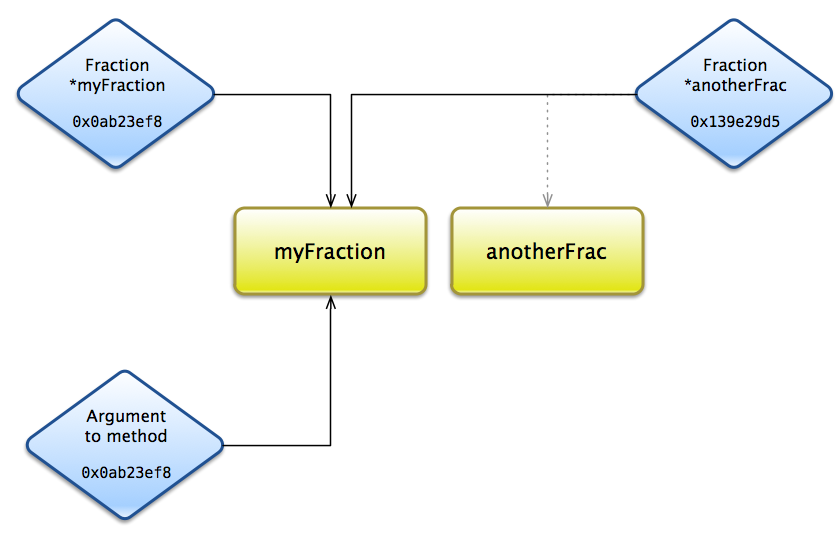

## Learn Objective-C: Pointers

You’ve probably noticed that when we declare objects,

```objc
Fraction *myFraction;
```

We put an asterisk between the object type and the name of the object (it doesn’t matter if you place it after the type, like `Fraction* myFraction`, in the middle, like `Fraction * myFraction`, or as above). This is not a typo; we’re saying that we are creating a pointer to an object.

### Why Pointers?

At the very basic level, objects are simply a collection of data (and methods). This data has to reside somewhere, and for the most part, this data is located in your computer’s RAM. But some objects can contain a lot of data, and start to take up a lot of RAM. This problem is further augmented if you have many objects. Of course, it’s always a good idea to minimize RAM usage, especially on a platform like iPhone where RAM can be scarce. Pointers, rather than storing an actual copy of an object, simply store the memory address of an object—it points to an object. Therefore, a pointer takes up a lot less RAM than an object itself would. This also makes code more efficient.

You’ll probably notice that in our methods, we also pass pointers around rather than actual objects (as specified by the asterisk following any class type). This means, first of all, that we are only passing small blocks of data around, not a large amount of data that corresponds to an object itself. This also means that you’re not passing in a copy of an object—you’re passing in a copy of a pointer. This will have significant effects, as described below. But first,

### What are Pointers?


*Pointers "point" to actual objects in memory.*

A pointer is simply a value that stores an in-memory location. They are generally written in *hexadecimal*, and look something like `0x0ab23ef8`. You don’t have to worry about what they look like, or how they work. They are generally treated as objects, but they aren’t. There only exists one copy of the actual object in memory (unless you explicitly make a copy), but multiple pointers can point to that same object.


*Multiple pointers pointing to the same object.*

### Pitfalls

The most important consideration here is memory management. Given the diagram above, consider what would happen if you wrote this line:

```objc
anotherFrac = myFraction;
```

This is a rather innocent line, and it does assign the value of `myFraction` to `anotherFrac`. But remember that `myFraction` contains a memory address, not an actual `Fraction` object. This means that now `anotherFrac` points to the same object as `myFraction`, and, more importantly, nothing points to the original `anotherFrac`:



*Don't do this.*

Now, you have no way to get to the original `anotherFrac`, and so that object will reside forever in memory (or until the application is quit or the system is turned off). This object is considered to be leaked; if you leak too many objects, you’ll run out of memory, and on the iPhone the system will force your app to quit. Regardless of where you are, leaking is not a good thing.

The other thing to consider is the case of multiple pointers to the same object, as you might have when you pass a pointer to an object as an argument to a method (as you usually do). Any changes that you make to one of the pointers will also be reflected in the other (because they point to the same object in memory, after all). This can have undesired consequences; you could also use this to your advantage. For example, if you wrote a class method that reduced a Fraction, you could have the method directly affect the original fraction you pass in; you could also make a copy of that fraction. On the other hand, you might mess up a data set from the user, forcing you prompt the user again for the same data…

Pointers are a central tenet of Objective-C (and all of object-oriented programming). All objects are represented as pointers- the original object is implicitly created. Used properly, they are a great tool.

---

[Previous Lesson](68.md) | [Next Lesson](69.md)
